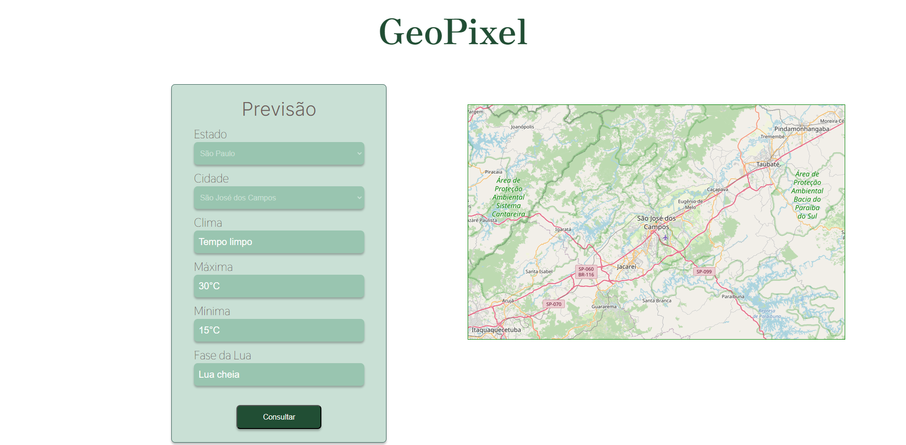

# GeoPixel 

O desafio é uma aplicação web que forneça ao usuário um mapa e uma interface simples onde ele possa consultar a previsão do tempo para cidades do Brasil, movendo o mapa para a cidade pesquisada pelo usuário e salvando suas pesquisas para que possam ser acessadas posteriormente.

##  ⚙️ Ferramentas

- Typescript
- React 18.2
- OpenLayers
- Axios

## 🪟 Interface

- Figma: https://www.figma.com/design/Eh8DIaPJ4vyaVV9HeGqkpV/GeoPixel?node-id=0%3A1&t=VMRgfkrlZiZ13UZg-1



## 🚀 Rode o projeto

### 1. Clone o repositório

```
git clone git@github.com:nicholasboari/geopixel-teste.git
```

### 2. Vá para o diretório

```
cd geopixel-teste
```

### 3. Rode o projeto

```
npm install
npm run dev
```

- A aplicação é iniciada na porta 5173
- As chaves necessárias para rodar o projeto já estão inseridas sem a utilização de environment

# Autor

**Nome do Autor:** Nicholas Boari

**Contato:**
- E-mail: nicholasboari@gmail.com
- LinkedIn: https://www.linkedin.com/in/nicholasboari/
- GitHub: https://github.com/nicholasboari
